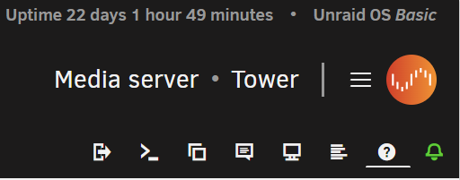

# Important considerations

Once you've completed your initial setup, there are a few more things you should know how to do on your server.

## Backing up the flash device

It is a good idea to have your Unraid flash device backed up any time you make a significant configuration change. Regular flash backups are highly recommended:

* On the **Main** tab, select your flash device, then **Flash Backup**. Make sure to store your backups off of your Unraid array so it is easily accessible even if the array is not operational.
* Alternatively, install the [Unraid Connect](/connect/about.md) plugin which provides automated backups of the flash drive to LimeTech cloud-based servers.

## Using the built-in help

Unraid has extensive help text for all major settings built into the WebGUI. When enabled the Help text will be displayed under the relevant setting.

The help text can be toggled on/off at the global level by selecting the "**?**" icon at the top-right of the WebGUI. It can be switched on/off at the individual field level by clicking on the name of the field.

It is **strongly** recommended that you make use of this feature as the information available via that route is likely to be more extensive and up-to-date than any documentation.

## Security practices

Your Unraid server is likely to end up containing data that is valuable to you so it can be a good idea to review the [Security Good Practices](../manual/security/good-practices.md) part of the documentation to ensure you are not doing something that may leave your system open to attack while leaving your valuable data at risk.
