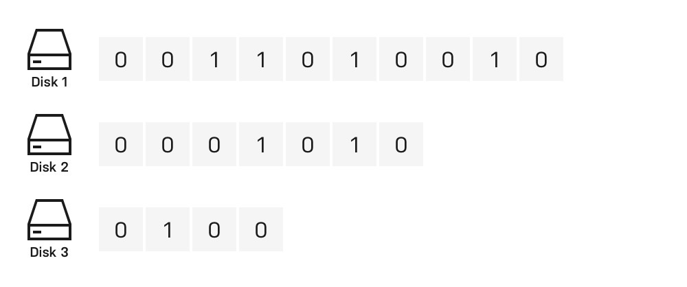
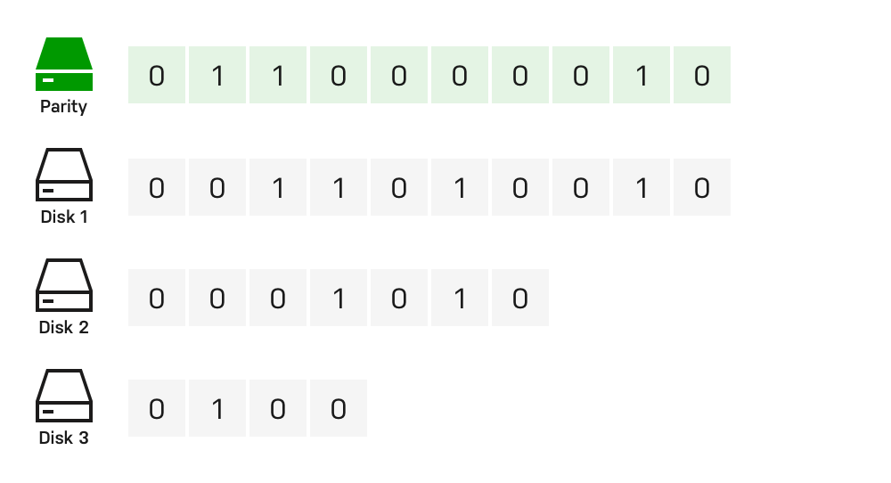
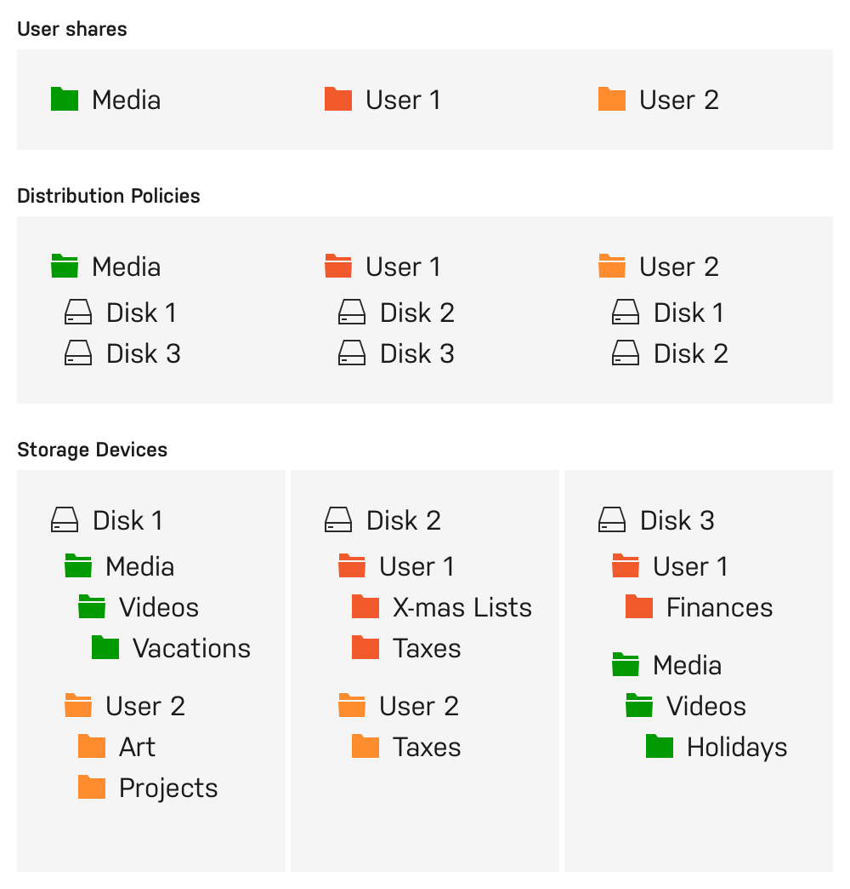
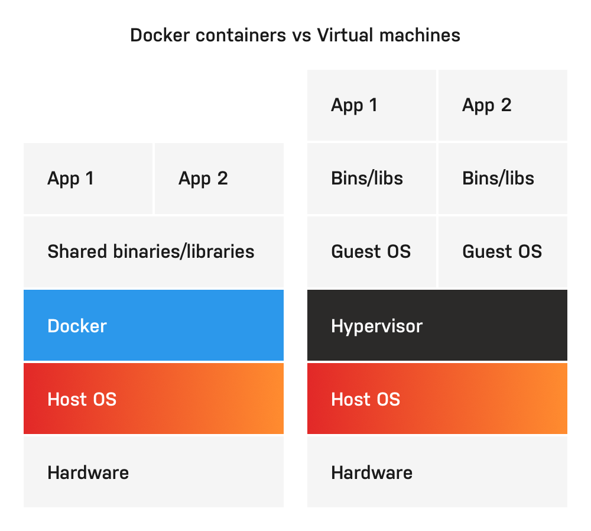
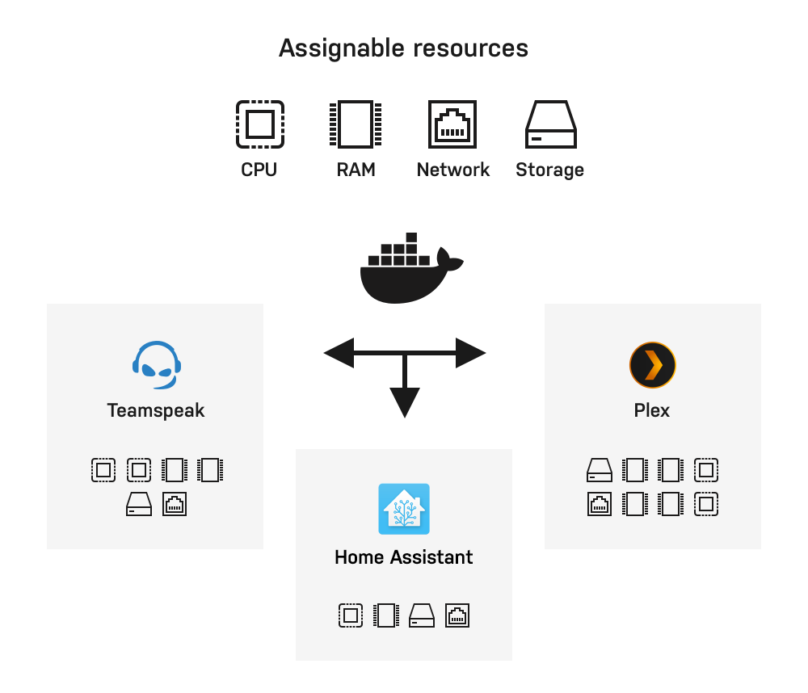

# What is Unraid?

Unraid® is an embedded operating system that is designed to provide you
with the ultimate control over your hardware. In addition to performing
the duties of a robust NAS (network-attached storage), Unraid is also
capable of acting as an application server and virtual machine host.
Unraid installs to and boots from a USB flash device and loads into a
root RAM file system. By using a modern Linux kernel with up-to-date
hardware drivers, Unraid can operate on nearly any 64 bit system
(x86_64) with minimal consumption of system memory. All configuration
data relating to the operating system is stored on the flash device and
loaded at the same time as the operating system itself. Management of
your Unraid system is accomplished through an intuitive web interface
that offers basic controls for common tasks as well as advanced tuning
options for the more savvy user. Unraid automatically chooses default
settings that should work for most people's needs, but also allows you
to tweak settings to your liking. This makes Unraid intuitive where you
want it, and tunable where you need it. By combining the benefits of
both hardware and software agnosticism into a single OS, Unraid provides
a wide variety of ways to store, protect, serve, and play the content
you download or create.

The capabilities of Unraid are separated into three core parts:
software-defined NAS, application server, and localized virtualization

## Network Attached Storage

At its core, Unraid is a hardware-agnostic solution that can turn almost
any 64-bit capable system into a NAS. Unraid can manage an array of
drives (connected via IDE, SATA, or SAS) that vary in size, speed,
brand, and filesystem. In addition, by eliminating the use of
traditional RAID-based technologies, we can scale on-demand by adding
more drives and without needing to rebalance existing data. Unraid's
NAS functionality consists of a parity-protected array, user shares, and
an optional cache pool.

### Parity-Protected Array

The primary purpose of an Unraid array is to manage and protect the data
of any group of drives (JBOD) by adding a dedicated _parity drive_. A
parity drive provides a way to reconstruct all of the data from a failed
drive onto a replacement. Amazing as it seems, a single parity drive can
add protection for all of the others! In Unraid parity is always
maintained in real-time and a bit more detail on the access pattern to
the drives is described under [Manual/Storage
Management](storage-management.md) with their performance
implications.

The contents of a hard drive can be thought of as a very long stream of
bits, each of which can only be a zero or a one. If you sum the values
of the nth bit on every drive and determine whether that sum is even or
odd, then you can force the corresponding nth parity bit to also be even
or odd (zero or one). If a data drive fails, that parity information can
now be used to deduce the exact bit values of the failed drive, and
perfectly rebuild it on a replacement drive. Here's an example:

In the picture above, we have three drives and each has a stream of bits
that vary in count based on the device size. By themselves, these
devices are unprotected and should any of them fail, data will be lost.
To protect ourselves from failure, we must add a fourth disk to serve as
parity. The parity disk must be of equal or greater size than the
largest data disk. To calculate the value of each bit on the parity
disk, we only need to know the sum total for each column. If the sum of
a column is an even number, the parity bit should be a 0. If the sum of
a column is an odd number, the parity bit should be a 1. Here's the
same image as before, but with parity calculated per frame:

Now let's pretend that drive 2 in our example has suffered a failure
and a new drive has been purchased to replace it:

To rebuild the data on the newly replaced disk, we use the same method
as before, but instead of solving for the parity bit, we solve for the
missing bit. For column 1, the sum would be 0, an even number, so the
missing bit must be a 0 as well. For column 6, the sum would be 1, an
odd number, so therefore the missing bit must also be a 1.

The ability to rebuild a disk using parity provides protection from data
loss. Parity protection also provides fault-tolerance by allowing full
usage of the system while keeping all data accessible, even when a drive
has failed.

### User Shares

Unlike most RAID systems, Unraid saves data to individual drives. To
simplify manageability, users can create _shares_ that allow files
written to them to be spread across multiple drives. Each share can be
thought of as a top-level folder on a drive. When browsing through a
share, all data from all drives that participate in that share will be
displayed together. Users do not need to know which disk a file is on in
order to access it under a share. Shares can be tuned to include/exclude
specific disks and to use various methods for determining how files are
allocated across those disks. In addition to controlling how data is
distributed across drives, users can also control what network protocols
the share is visible through as well as define user-level security
policy. When accessing your Unraid server over a network protocol, all
shares exported through that protocol will be visible, but you can
toggle protocols for both individual shares as well as at a global
setting level. Should you have private data on your system that you wish
to protect from anonymous access, user accounts can be created and
policies defined to limit access to only trusted individuals.

### Cache

The cache-drive feature of Unraid provides faster data capture.
Generally speaking, by using a cache alongside an array of three or more
drives, you can achieve up to 3x write performance. When data is written
to a user share that has been configured to use the cache drive, all of
that data is initially written directly to the dedicated cache drive.
Because this drive is not a part of the array, the write speed is
unimpeded by parity updates. Then an Unraid process called "the mover"
copies the data from the cache to the array at a time and frequency of
your choosing (typically in the middle of the night). Once the mover
completes, the space consumed previously on the cache drive is freed up.

With a single cache drive, data captured there is at risk, as a parity
drive only protects the array, not the cache. However, you can build a
cache with multiple drives both to increase your cache capacity as well
as to add protection for that data. The grouping of multiple drives in a
cache is referred to as building a _cache pool_. The Unraid cache pool
is created through a unique twist on traditional RAID 1, using a BTRFS
feature that provides both the data redundancy of RAID 1 plus the
capacity expansion of RAID 0.

## Application Server

Traditional NAS solutions to application support come with three primary
limitations:

1. They cannot support applications written for other operating
   systems.
2. They can be cumbersome to install and even more difficult to remove.
3. They don't always "play nice" with other applications in the same
   OS.

Docker addresses these problems in a number of key ways:

- It allows for the use of any Linux operating system to empower a
  given application (no longer limited by the operating system of the
  host itself).
- It removes the "installation" process that applications have to go
  through by providing pre-installed _images_ that ensure a consistent
  run-time experience for the user and making them easier to remove
  when the user is done with them.
- It enables applications that would normally have issues with
  coexistence to live in harmony in the same operating environment.

Docker is made up of three primary components: the Engine, the Hub, and
Containers.

### The Engine

The Docker Engine represents the management component that is built into
Unraid 6. Using the engine, we can control application access to vital
system resources, interact with the Docker Hub, and isolate applications
from conflicts.

From a storage perspective, the engine leverages the copy-on-write
capabilities of the BTRFS filesystem combined with Docker images
provided through the hub. The images are essentially tar files with a
hierarchy so that other images which depend upon a common layer don't
need to replicate storage for the layer they share. The shared layers
are put in a read-only state, while changes made to them are reflected
only in the instance for the application that changed it. In simpler
terms, this means that applications can be efficient in their use of
both system performance and storage capacity.

This differs from virtual machines where the entirety of the guest
operating system is emulated. The overhead required to support a virtual
machine is therefore much higher than the equivalent overhead for a
container. Docker containers that feature common libraries and binaries
do not replicate those shared resources and instead, leverage the
efficiency of Linux and a copy-on-write filesystem to minimize the
overhead.

### The Hub

One of biggest advantages Docker provides over both traditional Linux
containers (LXCs) and virtual machines (VMs) is in its application
repository: the Docker Hub. Many traditional Linux operating systems
nowadays come with a component in their framework known as a _package
manager_. The job of the package manager is to let people easily install
applications written for a particular operating system from catalogs
that are known as _repositories_. While package managers do their job
fairly well, they come with all the limitations mentioned earlier. Linux
containers and virtual machines, while competent at providing a way to
control resources allocated to an application, still rely on traditional
package managers for software retrieval and installation into their
run-time environments.

In contrast, the Docker Hub provides all the benefits without the
limitations of a traditional package manager. Using the Docker engine,
pre-built applications can be downloaded automatically and, thanks to
the copy-on-write benefits we've already covered, the only data that is
actually downloaded is data not already present on your system. The hub
contains over 14,000 Dockerized apps, so finding what you're looking for
shouldn't be a problem. In addition, thanks to some of our loyal
community members, users can quickly add many of the most popular
containers through the use of templates in Unraid 6. These forum members
have taken it upon themselves to build and maintain these templates and
the list of available templates continues to grow.

The Docker Hub can be accessed at http://registry.hub.docker.com.

### Containers

The cornerstone of Docker is in its ability to use Linux control groups,
namespace isolation, and images to create isolated execution
environments in the form of Docker containers. Docker controls the
resources allocated to the Containers and isolates them from conflicting
with other applications on the same system. This provides all the
benefits of traditional virtual machines, but with none of the overhead
associated with emulating hardware, making containers ridiculously
efficient and in some studies, barely distinguishable from bare-metal
equivalents.

Docker works by allowing applications access to the system resources of
the host operating system, such as CPU, memory, disk, and network, but
isolates them into their own run-time environments. Unlike virtual
machines, containers do not require hardware emulation, which eliminates
overhead, hardware requirements, and provides near bare-metal
performance.

## Virtualization Host

Virtualization technology has advanced greatly since it was first
introduced and provides a wealth of benefits to users. By supporting the
use of virtual machines on Unraid 6, we can run an even wider array of
applications in isolated environments. While Docker containers are the
preferred method for running Linux-based headless applications, virtual
machines offer these unique benefits:

1. Run non-Linux operating systems (e.g. Windows).
2. Support drivers for physical devices independently of Unraid OS.
3. Customize and tune the guest operating systems.

Unraid Server OS is designed to run as a virtualization host, leveraging
a hypervisor to partition resources to virtualized guests in a secure
and isolated manner. To simplify, virtual machines can be assigned a
wider array of resources than Docker containers but still offer the same
benefits of isolated access to those resources. This enables Unraid
servers to handle a variety of other tasks, more than just
network-attached storage.

### Assignable Devices

Our implementation of KVM includes modern versions of QEMU, libvirt,
VFIO\*, VirtIO, and VirtFS. We also support Open Virtual Machine
Firmware (OVMF) which enables UEFI support for virtual machines (adding
SecureBoot support as well as simplified GPU pass through support). This
allows for a wide array of resources to be assigned to virtual machines
ranging from the basics (storage, compute, network, and memory) to the
advanced (full PCI / USB devices). We can emulate multiple machine types
(i440fx and Q35), support CPU pinning, optimize for SSDs, and much more.
Best of all, these virtualization technologies prevent their use from
impacting the reliability of the host operating system.

## Simplified Management

Management of your Unraid system is accomplished through an intuitive
web interface that offers basic controls for common tasks as well as
advanced tuning options for the more savvy user. Unraid automatically
chooses default settings that should work for most people's needs, but
also allows you to tweak settings to your liking. This makes Unraid
intuitive where you want it, and tunable where you need it.

- **Dashboard View**. With indicators for disk health, temperatures,
  resource utilization, and application states, the dashboard provides
  a 50,000 foot view of what's happening on your system.
- **Array Operation**. Assign devices for use in either the array or
  cache, spin up and down individual disks, start and stop the array,
  and even perform an on-the-fly parity check, all from a single page.
- **Share Management**. Setting up shares on Unraid is easy. Give the
  share a name, optionally apply policies to access and distribution
  controls, and click create!
- **Disk Tuning**. Control how and when devices spin down, the default
  file system format, and other advanced settings.
- **Network Controls**. Enable NIC bonding and bridging, set time
  servers, and more.
- **APC UPS Safe Shutdown**. When connected to an APC UPS, Unraid can
  safely shut down the system in the event of a power loss.
- **System Notifications**. Unraid can alert you to important events
  happening on your system through the web management console as well
  as e-mail and other notification systems.
- **Task Scheduler**. Choose if and when you want to have an automatic
  parity check occur as well how often the mover script should
  transfer files from the cache to the array.
- **Docker Containers**. Manage application controls from a single
  pane of glass. Add applications with minimal effort using
  community-provided templates.
- **Virtual Machines**. Choose between pre-created virtual machine
  images or create your own custom VM from scratch.
